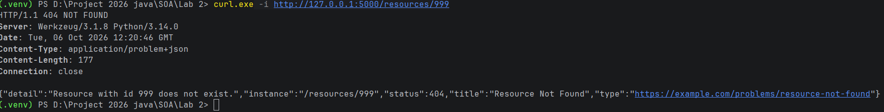
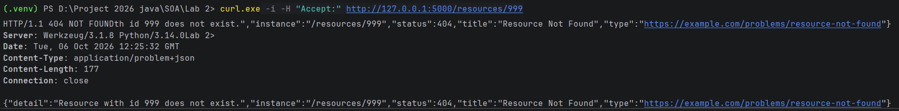
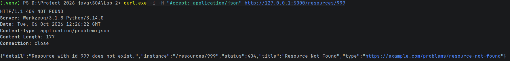
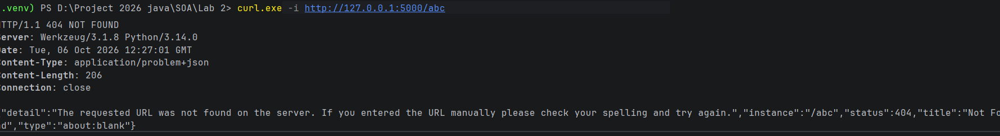
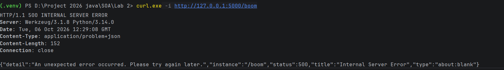

test 404 : curl.exe -i curl.exe -i http://127.0.0.1:5000/resources/999

ko co Accept : curl.exe -i -H "Accept:" http://127.0.0.1:5000/resources/999

co Accept : curl.exe -i -H "Accept: application/json" http://127.0.0.1:5000/resources/999

route k ton tai : curl.exe -i http://127.0.0.1:5000/abc

500 : curl.exe -i http://127.0.0.1:5000/boom
