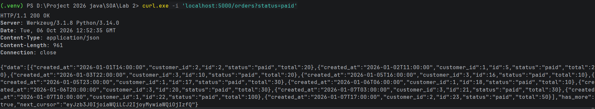
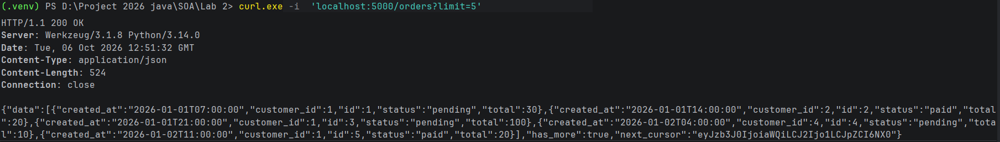
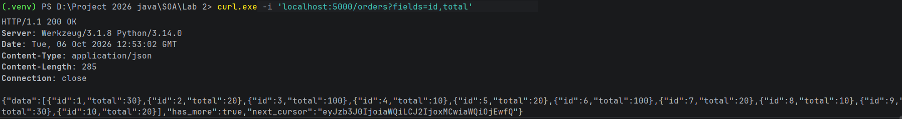
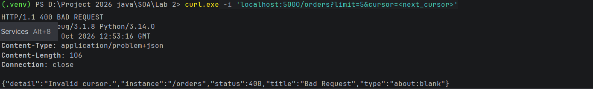
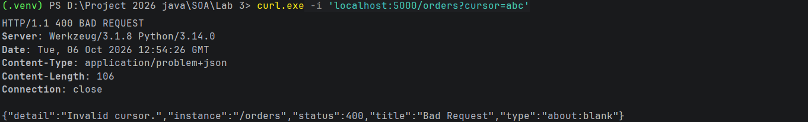
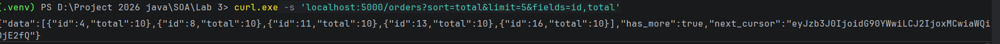
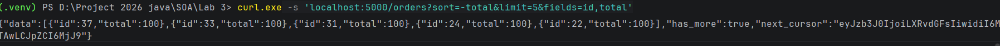

test theo yeu cau : curl.exe -i 'localhost:5000/orders?status=paid'

curl.exe -i  'localhost:5000/orders?limit=5'  

curl.exe -i 'localhost:5000/orders?fields=id,total'

curl.exe -i 'localhost:5000/orders?limit=5&cursor=<next_cursor>'

curl.exe -i 'localhost:5000/orders?cursor=abc'

cursor + sort : curl.exe -s 'localhost:5000/orders?sort=total&limit=5&fields=id,total'
 total bang nhau thi id tang dan

curl.exe -s 'localhost:5000/orders?sort=-total&limit=5&fields=id,total'   sort giam 
  total = nhau thi id giam 